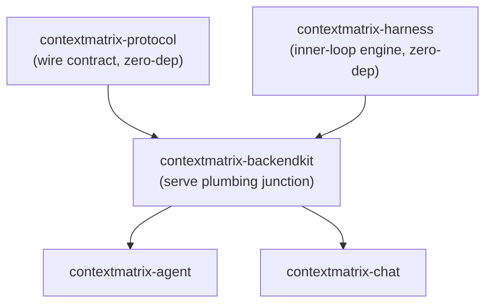

# contextmatrix-backendkit

Shared serve plumbing for the two ContextMatrix execution backends,
`contextmatrix-agent` and `contextmatrix-chat`. Both backends run a near-identical
host service around `contextmatrix-harness` (webhook auth, task-skills
resolution, the worker stdin frame codec, Prometheus metrics, and log
streaming) and the duplication was actively drifting: the same bugs were
fixed twice, on different days, in different repos. backendkit is the
junction module that lets both backends depend on one copy of that plumbing
instead of two.

## Architecture



`contextmatrix-protocol` and `contextmatrix-harness` stay zero-dependency by
design - neither can import the other's backend concerns. backendkit is the
one module allowed to depend on both, so it carries the plumbing that needs
pieces of each.

## Governing rule

**Extraction never changes behavior.** Every package below is ported, not
redesigned: if the agent's and chat's copies of a piece differ anywhere
beyond a small, named seam, that piece stays per-repo and the kit's scope
shrinks. There is no unifying of semantics under the banner of extraction.

## Packages

Five named seams. A piece that needs a sixth goes back to per-repo code
instead of growing this list.

| Package | What it holds |
| --- | --- |
| `webhookcore` | HMAC auth middleware, replay cache, the SSE `/logs` handler, and the shared HTTP helpers (JSON decode/encode, health, readyz, images) behind both backends' webhook servers. |
| `taskskills` | The signed-GET task-skills pointer fetch and shallow git clone shared by both backends' worker provisioning. |
| `frames` | The JSON Lines control-frame codec written to a worker container's stdin and read back by the work command, with the accepted frame-type set injected per backend. |
| `metrics` | The common Prometheus registry bundle (go/process collectors plus the shared HTTP metrics) built from a per-backend namespace so existing metric names stay byte-identical. |
| `logbridge` | The fan-out hub and harness-event-to-`protocol.LogEntry` classifier that streams worker output to the UI. |

Only `frames` is implemented so far. The remaining four are ported in later
extraction PRs, each with its own tests carried over from the two backends.

## Versioning policy

backendkit follows the harness operating model, not protocol's: v0.x,
additive changes preferred, breaking changes allowed with coordinated
lockstep consumer bumps, tags cut only when a consumer needs one. There are
two consumers and this is an internal library - protocol's never-break
contract would be ceremony here.

## Verification

```bash
go fix ./...
make fmt
make test
make test-race
make lint
make deps-gate
make build
```

`make deps-gate` enforces the boundary: no dependency on any ContextMatrix
backend or server repo, and `contextmatrix-harness` usage confined to
`events` and `redact`.
